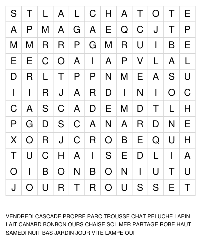

# Exercices et jeux niveau CP

Les jeux/exercices sont générés aléatoirement : la difficulté peut varier. Chaque script génère un type d'exercice différent, des aperçus sont disponibles dans le dossier `preview` et dans ce fichier README. Cliquez sur l'aperçu pour ouvrir le pdf correspondant.

Les pdf générés ont les dimensions de la tablette `Remarkable 2` (à adapter en fonction de vos besoins) :

```python
PAGE_WIDTH, PAGE_HEIGHT = 1404, 1872
```


Pour une appli de calcul mental, voir [Calcul mental CP](https://alexisflesch.github.io/calcul/). Pour développer la logique, voir aussi [ce jeu de takuzu](https://takuzu.alexisfles.ch) (les grilles de taille 4 sont très accessibles, celles de taille 6 aussi après un peu d'entraînement). Dans la même veine, [des grilles de Sudoku de petites taille](https://github.com/alexisflesch/sudoku_generator) sont disponibles.

## grilles.py

Formes géométriques à recopier.

[](out/grilles.pdf)


## comparaison.py

Comparaison de nombres :
- Ranger par ordre (dé)croissant
- Comparer deux nombres
- Ecrire les nombres avant et après

[](out/comparaison.pdf)


## mots_meles.py

Mots mêlés.

[](out/mots_meles.pdf)